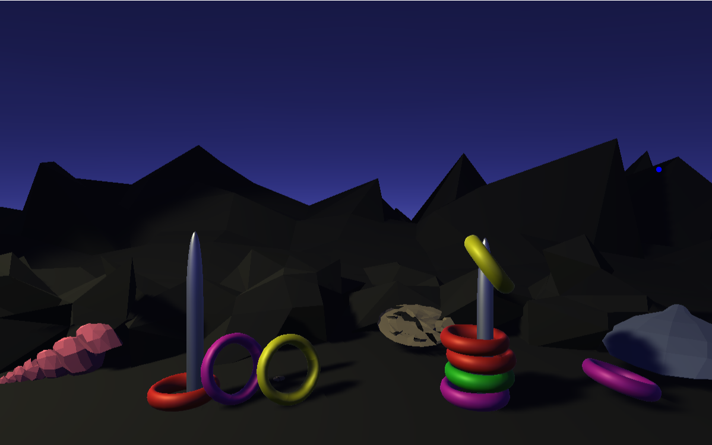

# Waterful Ring Toss 3D
My first Unity project

[Live Demo](https://modulariz.github.io/waterful-ring-toss-3D/)

To move the rings, click where you want them to fly from

--- 

|                   |
| :------------------------------------: |
| <b>Look mom! I made a videogame!</b>   |

If you want to know how movement works, go to `Assets/Movement.cs`

3D Shell models by [Rkuhl](https://www.turbosquid.com/es/Search/Artists/Rkuhl) 

